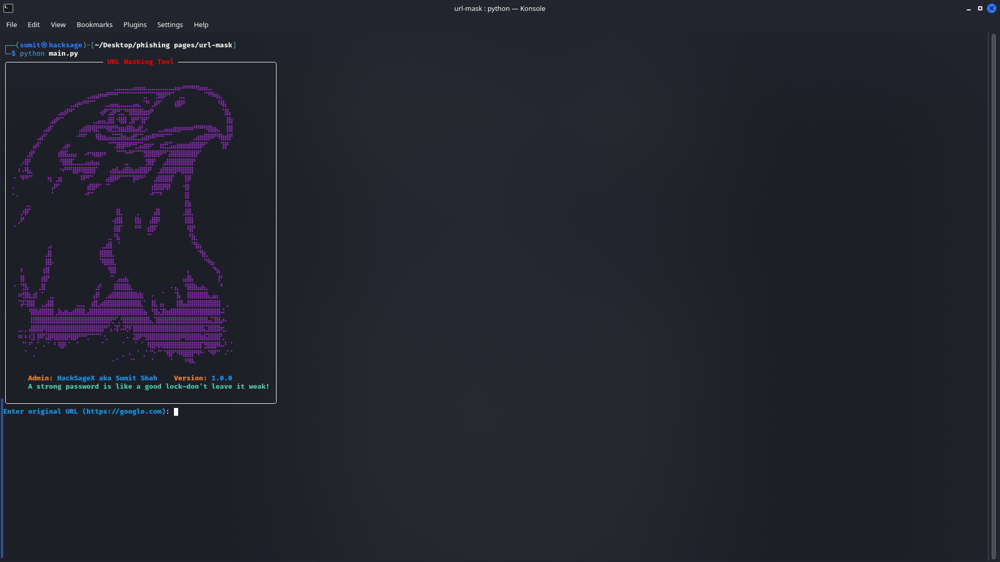
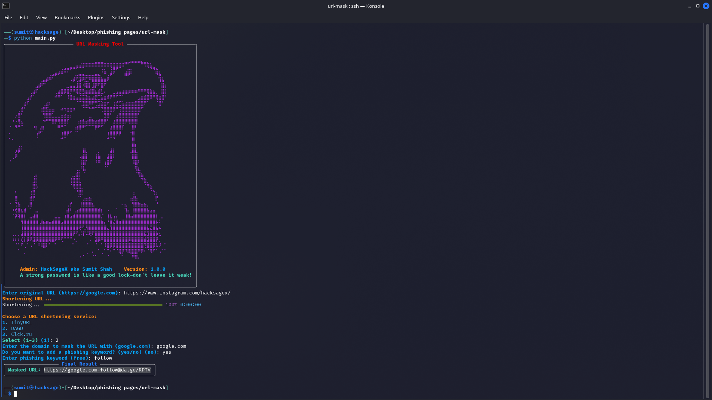

# 🌐 DarkRedirect 🚀

\
A powerful **URL masking** tool that shortens URLs and masks them with a custom domain and optional phishing-style keywords. Built with **Python**.

---

## ⚡ Features

🌜 Shortens URLs using TinyURL, DAGD, and Clck.ru.\
🌜 Masks URLs with custom domain and phishing keywords.\
🌜 Supports **animated banners** and dynamic quotes.\
🌜 Interactive CLI with progress bars and validations.\
🌜 Secure error handling & user-friendly experience.

---

## 📌 Pre-requisites

Make sure you have the following installed before running the script:

| Requirement  | Version |
| ------------ | ------- |
| Python       | >=3.6   |
| PyShorteners | Latest  |

Install dependencies using:

```sh
pip install -r requirements.txt
```

---

## ⚙️ Installation

Clone the repository and navigate into it:

```sh
git clone https://github.com/sumitshah00/DarkRedirect.git
cd DarkRedirect
```

Install the required Python libraries:

```sh
pip install -r requirements.txt
```

Run the tool:

```sh
python main.py
```

---

## 📚 How to Use

### 🔹 Run the tool

```sh
python main.py
```

You will be prompted to enter the original URL, custom domain, and optional phishing keyword.

### 🔹 Example Usage

#### Example 1: Basic URL Masking

```sh
Enter original URL: https://example.com
Enter domain to mask with: google.com
Do you want to add a phishing keyword? (yes/no): no
```

**Masked URL Output:**

```
https://google.com@example.com
```

#### Example 2: Adding a Phishing Keyword

```sh
Enter original URL: https://free-premium.com
Enter domain to mask with: facebook.com
Do you want to add a phishing keyword? (yes/no): yes
Enter phishing keyword: giveaway
```

**Masked URL Output:**

```
https://facebook.com-giveaway@free-premium.com
```

> **For better results, use DAGD as the URL shortener.**

---

## 🧭 Help & Commands

### ✅ Supported URL Shorteners

- TinyURL
- DAGD
- Clck.ru

---

## 🎮 Screenshots

### 🔷 CLI Interface



### 🔷 Example Output



---

## ⚠️ Disclaimer

> **This tool is for educational purposes only.** Do not use it for phishing or malicious activities. The author is not responsible for any misuse of this tool.

---

## 🎯 Contributing

Feel free to fork this repo, make improvements, and submit a pull request.

---

## ⭐ Support & Contact

If you like this tool, give it a ⭐ on GitHub!\
For any queries, contact **HackSageX aka Sumit Shah**.

📩 **INSTA:** [hacksagex](https://www.instagram.com/hacksagex/)\
🗮️ **GitHub:** [Hacksagex](https://github.com/sumitshah00)

